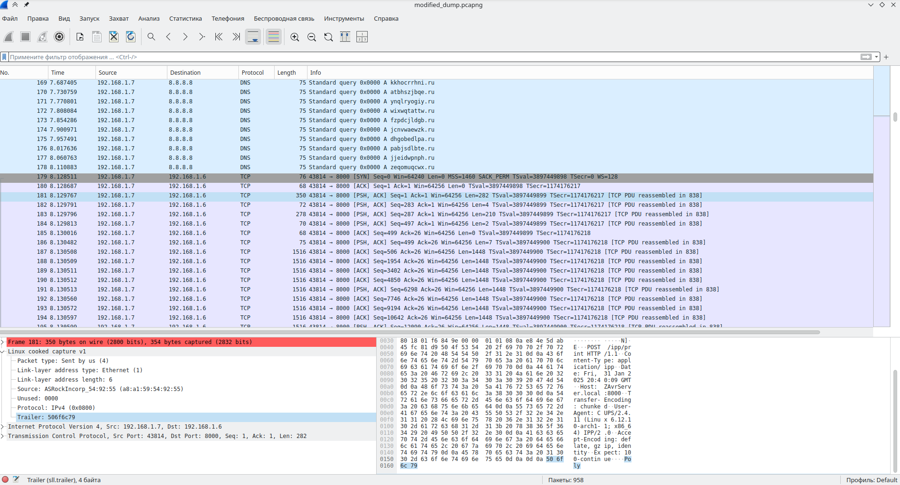

# Офисный Хакер | medium | forensics

## Информация
> У нас в офисе обнаружена утечка информации, однако никакого странного трафика не было замечено. Как же удалось слить информацию?

## Выдать участникам
файл [office_hacker.pcapng](public/office_hacker.pcapng)

## Описание
Для решения надо обратить внимание на битые TCP пакеты. В дополнительной информации(лишние байты) к пакетам и лежит флаг.

## Решение
Для решения надо обратить внимание на пакеты TCP которые в Wireshark подсвечивают характеристику красным:

В ней сказано, что пакет имеет лишние биты информации. Если пригледеться, то лишних байтов 4 и они являются частью флага. Надо собрать все кусочки и получим флаг. Можно вручную или с помощью [скрипта](solve/solver.py)

## Флаг
`PolyCTF{h1dd3n_d474_1n_pr1n73r_pr070c0l}`
