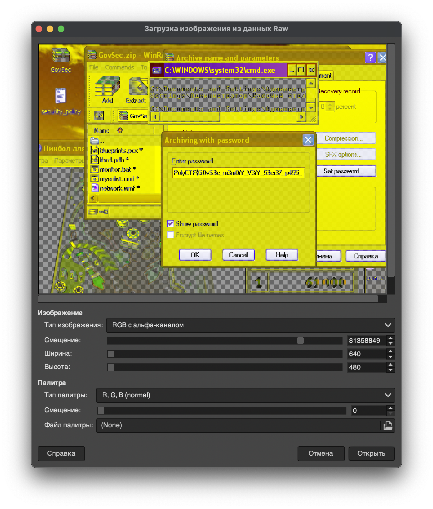

# Oleg | hard | forensics

## Информация
>  В конце 90-х мой отец работал в службе безопасности крупной государственной компании. Он был честным человеком, но однажды он исчез... Незадолго до моего рождения его не стало. Официальная версия – несчастный случай, но я почти уверен, что это было спланировано. Недавно, разбирая старый дом родителей, я нашел его старый компьютер. Образ памяти с него удалось извлечь, а вместе с ним – запароленный архив. Также я узнал, что эта компания использовала единый пароль для защиты своих архивов. Если мы сможем его найти, то не только откроем этот архив, но и получим доступ к другим данным компании.

## Выдать участникам
архив [Oleg.zip](https://disk.yandex.ru/d/cDg8t4Tyz0q9Hg)

## Описание
Вытащить из `Oleg-GovSec.vmem` файл `security_policy.txt` -> посмотреть снимок экрана памяти, оттуда получить часть пароля к архиву и по совместительству часть флага -> получить файлы из архива и ключ с помощью уязвимости ZipCrypto на известные 12 байт текста -> запустить prefix bkcrack и добрутить остальную часть флага.

## Решение
Прочитав описание мы немного вливаемся в лор повествования, у нас есть дамп памяти `Oleg-GovSec.vmem` и запароленный архив `GovSec.zip`.

Посмотрим содержание архива:
```sh
pig@door:~$ unzip -v GovSec.zip

Archive:  GovSec.zip
 Length   Encryption  Method    Size  Cmpr    Date    Time   CRC-32   Name
--------  ----------  ------  ------- ---- ---------- ----- --------  ----
     814   ZipCrypto  Stored      814   0% 1999-11-05 14:12 c3ec6dff  myenlist.cmd
 2407244   ZipCrypto  Stored  2407244   0% 1999-11-05 14:12 d5c6b501  network.wmf
    2543   ZipCrypto  Stored     2543   0% 1999-11-05 14:12 2e7cb53f  release.nfo
    2463   ZipCrypto  Stored     2463   0% 1999-11-05 14:12 60fbffab  report.prn
    2650   ZipCrypto  Stored     2650   0% 1999-11-05 14:12 07c5e348  security.cfg
    4822   ZipCrypto  Stored     4822   0% 1999-11-05 14:12 7eca911c  security_policy.txt
    2147   ZipCrypto  Stored     2147   0% 1999-11-05 14:12 7868b44f  system.log
 2085140   ZipCrypto  Stored  2085140   0% 1999-11-05 14:12 76eff28b  blueprints.pcx
   69632   ZipCrypto  Stored    69632   0% 1999-11-05 14:12 d0b23479  libcd.pdb
    2801   ZipCrypto  Stored     2801   0% 1999-11-05 14:12 d03a0c06  monitor.bat
--------                      -------  ---                            -------
 4580256                      4580256   0%                            10 files
```
Мы видим, что в архиве находятся несколько файлов. Даты этих файлов и их форматы отсылают нас к концу 90-х и началу 2000-х. Сам архив использует устаревшее шифрование ZipCrypto, а также все файлы имеют метод сжатия Store (то есть не сжаты). Уже с этой информацией можно начинать анализ дампа памяти с помощью Volatility.

Узнаём профиль дампа памяти:
```sh
pig@door:~$ volatility -f Oleg-GovSec.vmem imageinfo

Volatility Foundation Volatility Framework 2.6
INFO    : volatility.debug    : Determining profile based on KDBG search...
          Suggested Profile(s) : WinXPSP2x86, WinXPSP3x86 (Instantiated with WinXPSP2x86)
                     AS Layer1 : IA32PagedMemoryPae (Kernel AS)
                     AS Layer2 : FileAddressSpace (/home/pig/Oleg-GovSec.vmem)
                      PAE type : PAE
                           DTB : 0xae2000L
                          KDBG : 0x80544ce0L
          Number of Processors : 1
     Image Type (Service Pack) : 2
                KPCR for CPU 0 : 0xffdff000L
             KUSER_SHARED_DATA : 0xffdf0000L
           Image date and time : 2005-01-12 07:09:09 UTC+0000
     Image local date and time : 2005-01-12 10:09:09 +0300
```

Зная, что этот дамп сделан в Windows, мы можем посмотреть снимок экрана, который хранится в памяти в сыром виде.
Подробнее об этом можно узнать из [видео](https://youtu.be/uGSucD7nizk?si=-I3BntSTCI5Nt5iu)

Получаем такой снимок экрана:  


В нём видим ввод пароля в архив. Пароль даже видно, но не полностью, рамки поля ввода короче, чем сам пароль.
Приходим к выводу, что архив запаролен флагом, а мы смогли найти только его часть `PolyCTF{G0vS3c_m3m0rY_V3rY_53cr37_p455_`

Продолжаем иследовать дамп памяти с помощью volatility. В снимке экрана также можно было заметить в панели задач открытый блокнот с файлом, предположительно `security_policy.txt`, который видно в верхнем левом углу на скриншоте.

Давайте попробуем извлечь содержимое этого блокнота:
```sh
pig@door:~$ volatility -f Oleg-GovSec.vmem --profile=WinXPSP2x86 notepad

Volatility Foundation Volatility Framework 2.6
Process: 1960
Text:
============================================
          GovSec SecureNet Security Policy
============================================

????: 05.11.1999
??????: 1.2
?????????????: [REDACTED]

????????:
  ?????? ???????? ????????????? ???????????? ???????? ? ????????? ??? ??????????? ??????????????
  ???????????? ? ?????? ????????? GovSec SecureNet. ??? ?????????? ?????? ????????????????? ???????
  ?????? ????????? ??????????? ???? ?????????? ??? ?????? ?????????????????? ??? ? ???????????????? ??????.

...

5. ????? ?????????:
   - ?????? ???????? ???????? ???????????????? ? ???????????? ?????? ??? ??????????? ??????????? ????????????
     GovSec SecureNet.
   - ???????????????? ??????????????? ?????????? ??? ???????????? ????????????? ??????? ????? ???????????????
     ??? ????????? ??????????????? ????????????.
   - ? ?????? ??????????? ???????????, ?????? ????????? ?????? ??????????????? ????????? ?????? ???????????? ?
     ????? ????????????????? ??? ???????? ??????????? ???.

============================================
??????? ??????????????: ______________________
============================================

```
Оказывается, Volatility плохо обрабатывает кириллическую кодировку, поэтому заметка выглядит так странно.

Давайте распишем, что у нас есть на данный момент:
1. Архив `GovSec.zip` с устаревшим шифрованием ZipCrypto и все файлы в нем Store (не сжаты)
2. Файл `security_policy.txt` в котором известна некоторая часть текста, а также скорее всего этот файл присутствует в самом архиве `GovSec.zip`
3. Мы знаем часть пароля от архива `PolyCTF{G0vS3c_m3m0rY_V3rY_53cr37_p455_`

Немного погуглив, можно найти инструмент [bkcrack](https://github.com/kimci86/bkcrack/tree/master), который реализует атаку на ZipCrypto с использованием 12 байт известного текста. А у нас как раз есть немного известного текста из файла `security_policy.txt`. Пробуем:
```sh
pig@door:~$ bkcrack -C GovSec.zip -c security_policy.txt -p sec.txt

bkcrack 1.7.1 - 2024-12-21
[00:43:39] Z reduction using 126 bytes of known plaintext
100.0 % (126 / 126)
[00:43:39] Attack on 70128 Z values at index 6
Keys: e4f5fd77 7d40f7c8 7b6f1f07
48.5 % (33985 / 70128)
Found a solution. Stopping.
You may resume the attack with the option: --continue-attack 33985
[00:44:19] Keys
e4f5fd77 7d40f7c8 7b6f1f07
```

Ключи нашлись, теперь у нас есть два пути. 


Первый, с помощью этих ключей создать новый архив с новым паролем и посмотреть файлы в архиве:
```sh
pig@door:~$ bkcrack -C GovSec.zip -k e4f5fd77 7d40f7c8 7b6f1f07 -U new_GovSec.zip password

bkcrack 1.7.1 - 2024-12-21
[00:55:13] Writing unlocked archive new_GovSec.zip with password "password"
100.0 % (10 / 10)
Wrote unlocked archive.
```
К сожалению ничего интересного в этих файлах нет, а также мы знаем, что флаг это пароль, значит нужно копать куда-то ещё.


Приходим ко второму пути, по полученному ключу попробовать забрутфорсить пароль от архива, так как это тоже умеет делать bkcrack. Но проблема в том, что первые 6 символов находятся моментально, а вот остальные символы находятся от n<sup>(i-6)</sup>, где i - длина пароля, а n - размер набора символов. И в последней версии bkcrack не реализована функция брутить по маске с уже известной частью пароля.

Но сам брутфорс через bkcrack работает очень приятно, так-как первые 10 символов с printable ASCII находятся моментально, остальные варианты брутфорса zip-архивов не предлагают такой скорости. Поэтому начинаем ресерчить репозиторий. Находим несколько интересных обсуждений добавления функционала для брута пароля не с самого начала ([одно из обсуждений](https://github.com/kimci86/bkcrack/issues/55)). Оказывается, автору понравилась эта идея, но он почему-то не захотел добавлять этот функционал в основную ветку. К счастью он сделал отдельную ветку с таким функционалом и называется она [prefix](https://github.com/kimci86/bkcrack/tree/prefix).

В ней реализован флаг `-m`, который дает нам вставить известную часть пароля в брутфорс. Скачиваем, компилим и запускаем. Начнем брутить с 6 символов и продолжаем, пока не получится, благо первые 10 символов брутятся моментально, а вот остальные уже начинают тратить время. При переборе неизвестной части из 12 символов получилось следующее:
```sh
pig@door:~$ bkcrack -k e4f5fd77 7d40f7c8 7b6f1f07 -r 12 ?p -m "PolyCTF{G0vS3c_m3m0rY_V3rY_53cr37_p455_"

bkcrack 1.3.4 - 2025-02-03
[04:23:21] Recovering password
length 0-6...
length 7...
length 8...
length 9...
length 10...
length 11...         
length 12...         
39.5 % (3562 / 9025) 
[04:24:35] Password
as bytes: 50 6f 6c 79 43 54 46 7b 47 30 76 53 33 63 5f 6d 33 6d 30 72 59 5f 56 33 72 59 5f 35 33 63 72 33 37 5f 70 34 35 35 5f 45 4b 78 75 6a 30 61 74 6c 32 44 7d 
as text: PolyCTF{G0vS3c_m3m0rY_V3rY_53cr37_p455_EKxuj0atl2D}
```
Ура! Мы получили флаг (правильный пароль для архива), брутфорс занял чуть больше 1 минуты.

## Unintended решение
К сожалению в этом таске не обошлось без `uninteded` решений.

Оно было очень простым и никак не затрагивало работу с самим архивом `GovSec.zip`:
```sh
pig@door:~$ strings Oleg-GovSec.vmem | grep "CTF{"

CTF{G0vS3c_m3m0rY_V3rY_53cr37_p455_EKxuj0atl2D}
```
Об этом мне стало известно за час до конца соревнований, поэтому выпустить новый исправленный таск не получилось. В следующий раз буду внимательней.

## Слова автора
Изначально задание задумывалось как интересный вектор поиска информации. Почему-то многие CTF-еры просто находят инструмент и даже не пытаются понять, что там происходит и как он работает. А на самом деле в нём скрываются интересные фишки, которые используют уязвимость по полной.

Надеюсь, это задание и райтап помогли узнать что-то новое, и, надеюсь, вам было интересно.


## Флаг
`PolyCTF{G0vS3c_m3m0rY_V3rY_53cr37_p455_EKxuj0atl2D}`
