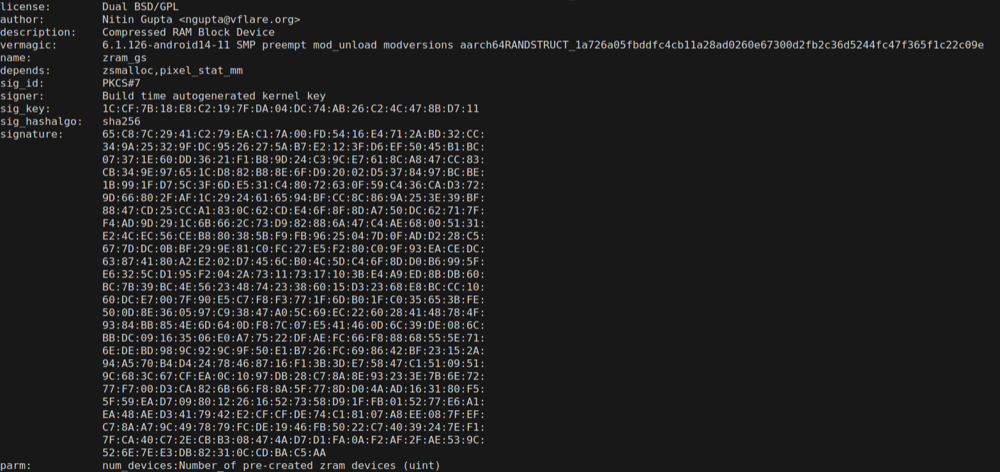
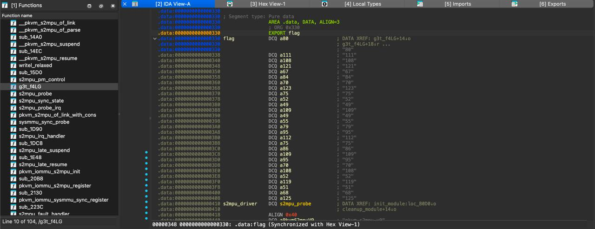

# pixel=y | medium | forensics

## Информация
> После подозрительной активоности на сервере, с ядром что-то не так...

## Выдать участникам
файл [caimito_dist.tar.zst](https://disk.yandex.ru/d/u52iAAWBuYHGBQ)

## Описание
Для решения надо обратить внимание на то, что в одном из модулей ядра была другая подпись и через такие утилиты как ghidra/IDA найти `flag` и декодировать из ASCII.

## Решение
 - Используя программу `modinfo` просмотреть метаданные всех модулей:

    Пример:

    

 - Найти что есть два различных хэша ключа:

    `modinfo *.ko | grep "sig_key" | awk '{print $NF}' | sort -u`

 - Потом найти модуль, который был подписан иным ключом. Это файл `pkvm-s2mpu-v9.ko`.
 - Открыть этот модуль в IDA/Ghidra и найти флаг в ASCII.

    

## Флаг
`PolyCTF{K41m17O_pKVm_Fl4w3D}`
