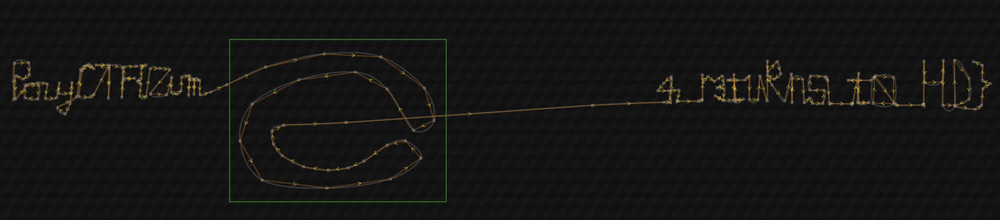

# Zuma | easy | misc

## Информация
> Скачал классную игрушку, но что-то в ней не так...

## Выдать участникам
архив [zuma.zip](https://disk.yandex.ru/d/BgmavyoLG7st6w)

## Описание
Находим в игре измененный уровень, открываем его в редакторе уровней

## Решение
Читаем описание и понимаем, что в этой игре что-то не так, пытаемся найти эту игру в интернете, к счастью авторы подписались в главном меню игры. Дальше находим их github и саму [игру](https://github.com/GalaxyShad/Zuma-Deluxe-HD). 

Проверяем файлы на соответствие и находим один измененный файл `claw.dat`, который отличается. 

Смотрим в самой игре именно этот уровень, понимаем, что с ним что-то не так. Гуглим что это и находим интересную [статью](https://hclxing.wordpress.com/2017/06/27/reverse-engineering-zuma-deluxes-level-file/). 

Дальше либо рисуем кодом график пути на этом уровне, либо находим [редактор уровней](https://alula.github.io/zuma-editor/) и получаем флаг.

## Флаг
`PolyCTF{Zum4_r3tuRns_t0_HD}`
