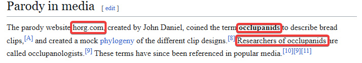

# Хлебные крошки | easy | osint

## Информация

> Я нашел необычный кусочек пластика, и слышал, что у него есть какое-то особенное название, помоги мне его определить. 
> Формат флага: PolyCTF{Genus_species}

## Выдать участникам
файл [image.png](public/image.png)

## Описание
Линзим картинку - зажим для хлеба - википедия - сайт с классификацией зажимов - флаг.

## Решение
Путем поиска по картинке находим что это Bread Clip - зажим для хлеба

На википедии или ином ресурсе находим информацию про исследователей зажимов для хлеба

Перейдя на сайт [horg.com]() обнаруживаем что каждый "вид" зажима имеет свой вид и название.

Найдя наиболее похожий, определяем что ответ  'Palpatophora glyphodorsalis'

## Флаг
`PolyCTF{Palpatophora_glyphodorsalis}`
