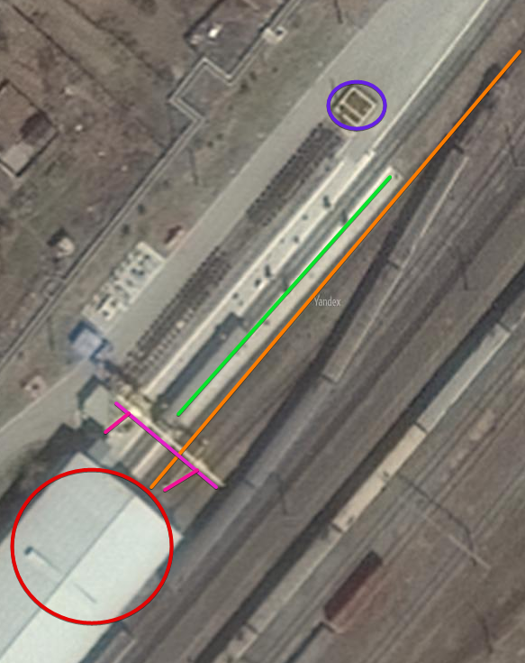
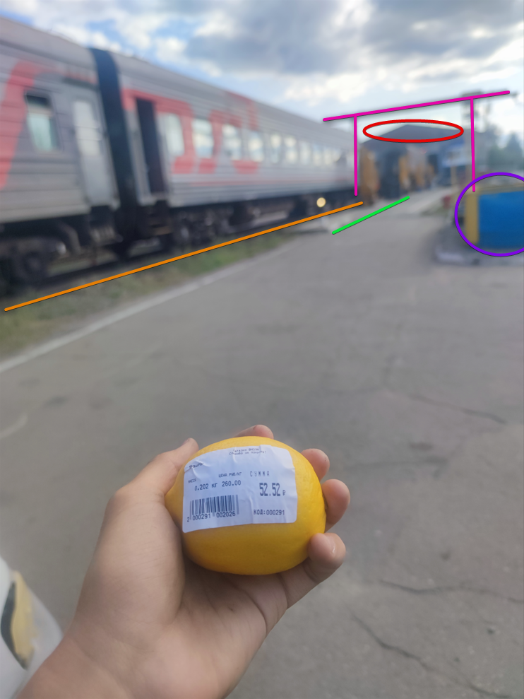

# Загадочный лимон | medium | osint

## Информация

> Технологии сюда еще не добрались, но лимонов хочется. Укажите место съемки.
> Формат флага: PolyCTF{xx.xxx,yy.yyy}

## Выдать участникам
файл [52.jpg](public/52.jpg)

## Описание
Из метаданных достать часовой пояс места съемки. По названию магазина на этикетке и часовому поясу найти город, в нем по жд-путям и приметным ориентирам место.

## Решение
В метаданных картинки находим информацию о дате сьемки по местному времени и времени по гринвичу. Путем несложных вычислений получаем часовой пояс +8.

Проверяем магазины Виола в регионах в данном часовом поясе

По запросу
> магазин Виола Бурятия

Находим город Северобайкальск, который построен на железной дороге.

Просмотрев жд в обе стороны, на спутниковой карте можно найти искомое место:

## Флаг
`PolyCTF{55.643,109.356}`
