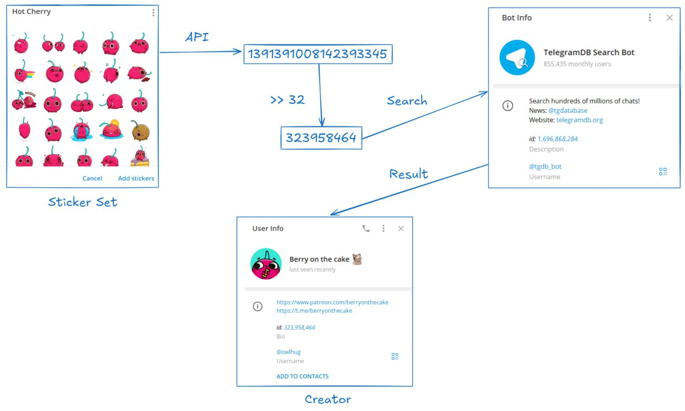
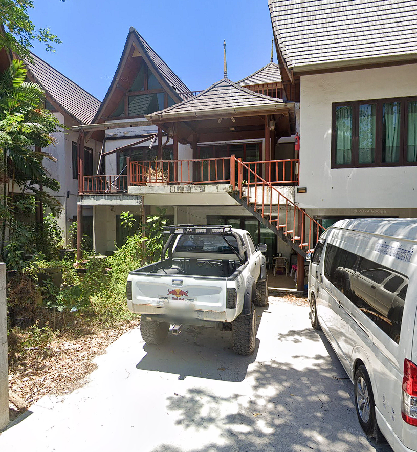
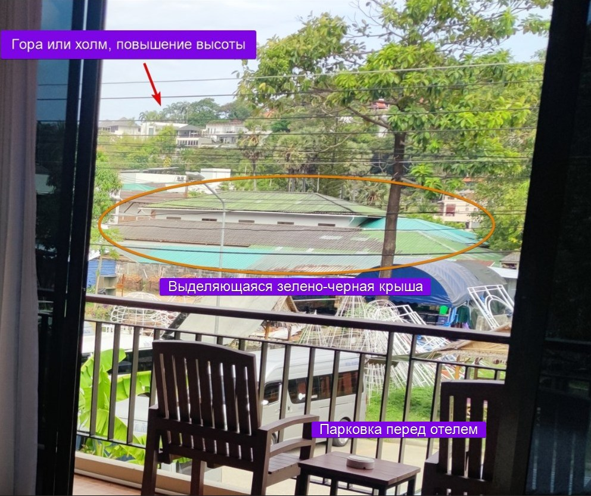
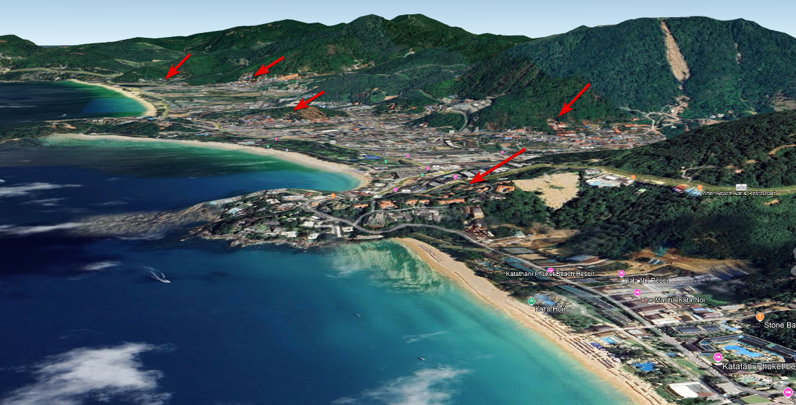
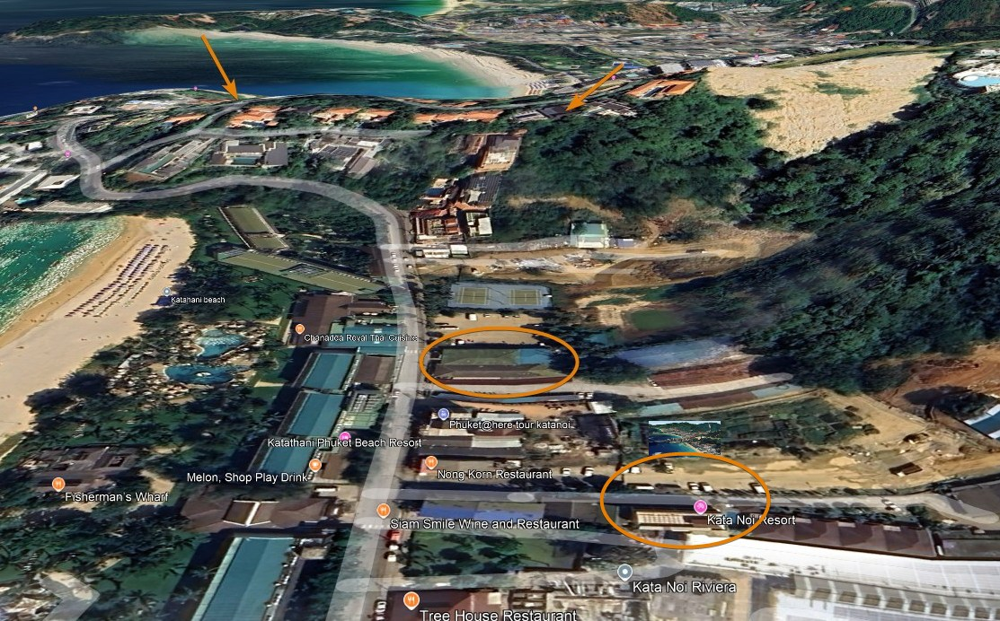
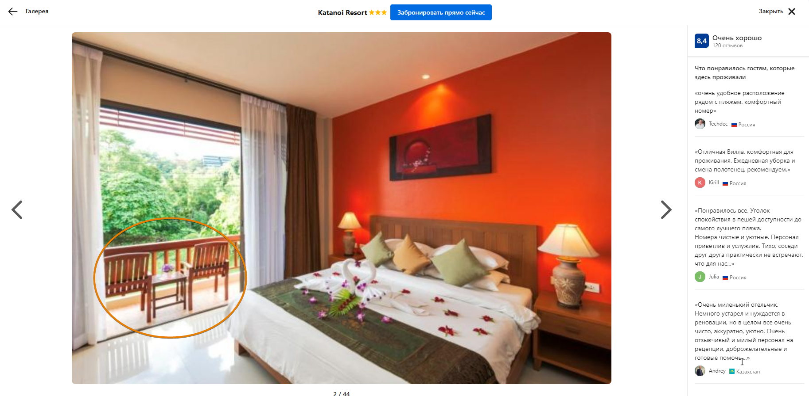
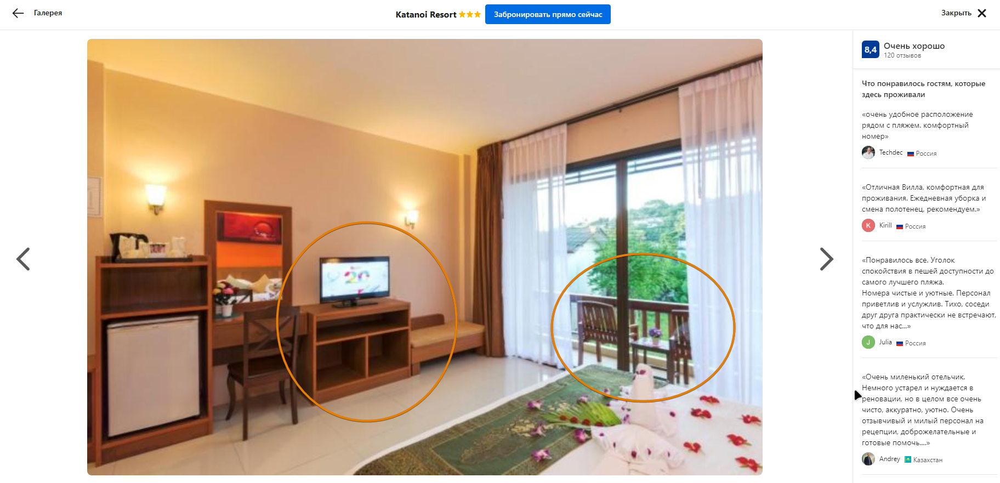
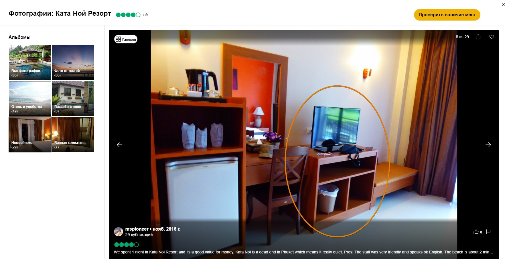

# Следы предательства Часть 3 | hard | osint
## Информация

> Нам необходимо найти владельца хакерской группировки, которая слила базу данных, он должен ответить по заслугам, и вы нам с этим поможете! Кажется, он опубликовал в своем личном телеграм канале фотографии своего текущего и прошлого мест проживания... 
> 
> Миссия №3: Определить точные координаты его текущего пребывания, и координаты отеля, в котором он останавливался до этого. Мы верим в вас, комрад! 
> 
> Формат флага PolyCTF{x.xxx_yy.yyy_x.xxxx_yy.yyyy} 
> (Текущее место 3 знака после точки, предыдущее 4 знака)!!!

## Выдать участникам
-

## Описание
тг канал -> ссылка с рефкой тг id -> получение пользователя -> личный канал -> geoint

## Решение
Изначальной идей таска была реализация этой уязвимости телеграма: 

Именно поэтому в телеграм канале публиковался стикер, но недавно-созданные стикеры создаются уже без этой уязвимости, хотя все еще можно узнать 'id' пользователя, через бота @SPOwnerBot в тг. Поэтому стикер это ложный путь.

В одном из [постов](https://t.me/evilhackercorp/6) в канале существует ссылка на бота, обертнутая в bit.ly в которой имеется refid в виде телеграм id пользователя (админа канала). 

Вставив его в @tgdb_bot, или аналогичный ему бот получим аккаунт @serg_hacker, в профиле у него будет ссылка на личный тг-канал про путешествия с двумя фото с его "отдыха". Начинается геоинт
# Фото 1. Текущее место проживания

Выглядит оно вот так:

Пролинзив картинку, увидим много ссылок на Kata Phuket с похожей архитектурой. Очень похожим по внешнему виду будет 
`Assada Boutique Hotel Kata Phuket`
Перейдя на его расположение в гугл картах и пройдясь по улице на которой он расположен, найдем искомое место: [Тык.](https://www.google.com/maps/@7.8171266,98.3084143,3a,75y,257.88h,94.08t/data=!3m7!1e1!3m5!1spVUdFeUhSdmZGr2vmxd2qA!2e0!6shttps:%2F%2Fstreetviewpixels-pa.googleapis.com%2Fv1%2Fthumbnail%3Fcb_client%3Dmaps_sv.tactile%26w%3D900%26h%3D600%26pitch%3D-4.084413429478175%26panoid%3DpVUdFeUhSdmZGr2vmxd2qA%26yaw%3D257.88053789252274!7i16384!8i8192?entry=ttu&g_ep=EgoyMDI1MDIwNS4xIKXMDSoASAFQAw%3D%3D)

Координаты: `7.817_98.308`
# Фото 2. Предыдущее место проживания
Оно выглядит вот так:

Так как это выглядит как отель и в посте к этому фото было написано, что это место недалеко от первого фото, логично будет рассматривать отели на трех пляжах: Kata, Kata-noi и Karon 

По фото видно, что отель не самый элитный, 3-4 звезды, не более.

На заднем фоне я хочу выделить несколько объектов:

Так же можно заметить не очень плотную застройку 

При просмотре рельефа например в Google Earth можно выделить несколько мест подходящих под холм с домами с оранжевой крышей на заднем фоне

быстро просмотрев все найдем и примечательную черно-зеленую крышу и парковку микроавтобусов у отеля `Kata Noi Resort`

Зайдя в карточки отеля на tripadvisor, booking.com и подобных сайтах, найдем такую же мебель (тумбу под телевизором, балкон со стульями)

Существуют команды, которые искали этот отель только по интерьеру, а рельефом не пользовались, и наоборот.

Координаты отеля(и примерной комнаты): `7.8072,98.3004`

## Флаг
`PolyCTF{7.817_98.308_7.8072_98.3004}`
