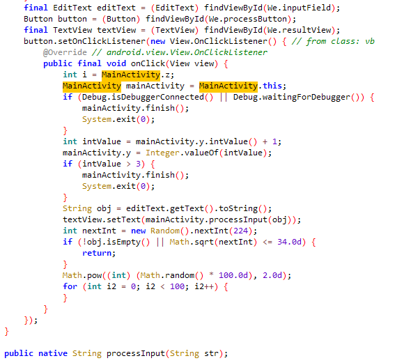

# Андрей Андреевич | hard | Reverse

## Информация
У меня был начальник Андрей Андреевич. Он сказал нам, что на ежеквартальном собрании через приложение на телефоне будет передано важное сообщение. Предупредил, что для получения сообщения необходимо ввести ключ, который он назовет во время собрания. Сейчас Андрей Андреевич заболел, связи с ним нет, а сообщение нам нужно получить срочно

## Выдать участникам
[folder](public/)

## Описание
Необходимо разреверсить бинарь и понять способ модификации строки.

## Решение.
При открытии MainActivity видно, что вызывается нативная функция processInput



В нативной функции происходит проверка длины строки и того, что она состоит только из латинских букв. Стоит начать с конца функции и посмотреть, что участвует в работе с входными и выходными данными, так как специально был добавлен мусор. После анализа можно написать небольшой скрипт, который подберет ключ длиной 5 латинских символов:
```
#include <iostream>
#include <string>
#include <cstdlib>
#include <cstring>

std::string ah(const char *in) {
    const size_t s2 = 0x5d3d;
    size_t h = s2;

    for (size_t i = 0; in[i] != '\0'; ++i) {
        h ^= static_cast<size_t>(in[i]);
        h = (h << 3) ^ (h >> 2);
        h *= 0x45d9f3b;
    }

    srand(h);
    std::string r;
    const char c[] = "abcdef0123456789";
    for (size_t i = 0; i < 16; ++i) {
        r += c[rand() % (sizeof(c) - 1)];
    }
    return r;
}

const char d1[] = {0x10, 0xE, 0xA, 0x2, 0x9, 0x33, 0xE, 0x4D, 0xC, 0x4D, 0xB, 0x1E,
                   0x5D, 0x3A, 0x3D, 0x4D, 0x24, 0x33, 0xB, 0x7, 0x8, 0x2F, 0x3D, 0xB,
                   0x1C, 0xE, 0x4C, 0x5D, 0x3, 0x11, 0x24, 0x6A, 0x2E, 0x15, 0x54, 0xC,
                   0x68};
const size_t s1 = sizeof(d1) / sizeof(d1[0]);

std::string dwl(const char *d, size_t sz, const std::string &k) {
    std::string im(sz, '\0');
    size_t ki = 0;

    for (size_t i = 0; i < sz; ++i) {
        im[i] = d[i] ^ static_cast<unsigned char>(k[ki]);
        ki = (ki + 1) % k.size();
    }
    std::string fn(sz, '\0');
    for (size_t i = 0; i < sz; ++i) {
        fn[i] = im[sz - i - 1] ^ 0x5A;
    }

    return fn;
}

void bruteForce() {
    const char chars[] = "abcdefghijklmnopqrstuvwxyzABCDEFGHIJKLMNOPQRSTUVWXYZ";
    const size_t num_chars = sizeof(chars) - 1;

    char ni[6] = {0};

    for (size_t i = 0; i < num_chars; ++i) {
        ni[0] = chars[i];
        for (size_t j = 0; j < num_chars; ++j) {
            ni[1] = chars[j];
            for (size_t k = 0; k < num_chars; ++k) {
                ni[2] = chars[k];
                for (size_t l = 0; l < num_chars; ++l) {
                    ni[3] = chars[l];
                    for (size_t m = 0; m < num_chars; ++m) {
                        ni[4] = chars[m];
                        std::cout << ni << std::endl;
                        std::string key = ah(ni);
                        std::string result = dwl(d1, s1, key);

                        if (result.find("PolyCTF{") != std::string::npos) {
                            std::cout << "Ключ: " << ni << std::endl;
                            std::cout << "Сообщение: " << result << std::endl;
                            return;
                        }
                    }
                }
            }
        }
    }
}

int main() {
    bruteForce();
    return 0;
}
```
Для быстроты можно распараллелить, но и так считается не очень долго. Самое сложное в этой задаче — разобраться среди мусорного кода и правильно перенести две функции в скрипт.

Исходный код:
```
#include <string>  
#include <cstring>  
#include <jni.h>  
#include <iostream>  
#include <cctype>  
#include <vector>  
#include <cstdlib>  
#include <ctime>  
#include <sys/ptrace.h>  
#include <algorithm>  
#include <random>  
  
#define A1(x) x  
#define A2(x) x  
#define A3(x) x  
  
void A1(f1)() {  
    volatile int x = 0;  
    for (int i = 0; i < 100; ++i) {  
        x += i * i;  
    }  
}  
  
void A2(f2)() {  
    volatile int y = 0;  
    for (int i = 0; i < 50; ++i) {  
        y += i % 3;  
    }  
}  
  
void A3(f3)() {  
    volatile int z = 0;  
    for (int i = 0; i < 200; ++i) {  
        z += i * (i % 5);  
    }  
}  
  
const char g1[] = {0x1A, 0x2B, 0x3C, 0x4D, 0x5E, 0x6F, 0x7A, static_cast<char>(0x8B), static_cast<char>(0x9C), static_cast<char>(0xAD), static_cast<char>(0xBE), static_cast<char>(0xCF)};  
  
struct S1 {  
    int a;  
    int b;  
    int c;  
    int d;  
};  
  
class C1 {  
public:  
    C1() {  
        A1(f1)();  
        A2(f2)();  
    }  
  
    ~C1() {  
        A3(f3)();  
    }  
  
    void dn() {  
        volatile int x = 0;  
        for (int i = 0; i < 100; ++i) {  
            x += i * i;  
        }  
    }  
};  
  
  
  
void gn() {  
    C1 c1;  
    c1.dn();  
  
    volatile int n = 0;  
    for (int i = 0; i < 1000; ++i) {  
        n += (i % 3) * (i % 7);  
    }  
}  
  
std::string ah(const char *in) {  
    const size_t s2 = 0x5d3d;  
    size_t h = s2;  
  
    for (size_t i = 0; in[i] != '\0'; ++i) {  
        h ^= static_cast<size_t>(in[i]);  
        h = (h << 3) ^ (h >> 2);  
        h *= 0x45d9f3b;  
    }  
  
    srand(h);  
    std::string r;  
    const char c[] = "abcdef0123456789";  
    for (size_t i = 0; i < 16; ++i) {  
        r += c[rand() % (sizeof(c) - 1)];  
    }  
  
    gn();  
  
    return r;  
}  
  
const char d1[] = {0x10, 0xE, 0xA, 0x2, 0x9, 0x33, 0xE, 0x4D, 0xC, 0x4D, 0xB, 0x1E,  
                   0x5D, 0x3A, 0x3D, 0x4D, 0x24, 0x33, 0xB, 0x7, 0x8, 0x2F, 0x3D, 0xB,  
                   0x1C, 0xE, 0x4C, 0x5D, 0x3, 0x11, 0x24, 0x6A, 0x2E, 0x15, 0x54, 0xC,  
                   0x68};  
const size_t s1 = sizeof(d1) / sizeof(d1[0]);  
  
std::string dwl(const char *d, size_t sz, const std::string &k) {  
    std::string im(sz, '\0');  
    size_t ki = 0;  
  
    for (size_t i = 0; i < sz; ++i) {  
        im[i] = d[i] ^ static_cast<unsigned char>(k[ki]);  
        ki = (ki + 1) % k.size();  
    }  
    std::string fn(sz, '\0');  
    for (size_t i = 0; i < sz; ++i) {  
        fn[i] = im[sz - i - 1] ^ 0x5A;  
    }  
  
  
    return fn;  
}  
  
bool coel(const char *s) {  
    if (s == nullptr) {  
        return false;  
    }  
  
    while (*s) {  
        if (!isalpha(static_cast<unsigned char>(*s))) {  
            return false;  
        }  
        ++s;  
    }  
    return true;  
}  
  
extern "C" JNIEXPORT jstring JNICALL  
Java_com_example_app_1hard_MainActivity_processInput(JNIEnv *env, jobject thiz, jstring input) {  
    const char *ni = env->GetStringUTFChars(input, 0);  
  
    if (ni == nullptr || strlen(ni) != 5) {  
        env->ReleaseStringUTFChars(input, ni);  
        return env->NewStringUTF("No!");  
    }  
  
    if (!coel(ni)) {  
        env->ReleaseStringUTFChars(input, ni);  
        return env->NewStringUTF("No!");  
    }  
  
    S1 gs;  
    gs.a = rand();  
    gs.b = rand();  
    gs.c = rand();  
    gs.d = rand();  
  
    std::string k = ah(ni);  
    //return env->NewStringUTF(k.c_str());  
  
    std::string df = dwl(d1, s1, k);  
  
    volatile int n = 0;  
    for (int i = 0; i < 1000; ++i) {  
        n += (i % 3) * (k[i % k.size()] % 7);  
    }  
  
    std::vector<int> gv;  
    for (int i = 0; i < 100; ++i) {  
        gv.push_back(rand());  
    }  
  
    env->ReleaseStringUTFChars(input, ni);  
    return env->NewStringUTF(df.c_str());  
}
```

## Флаг
`PolyCTF{1_L1k3_TCP}`
