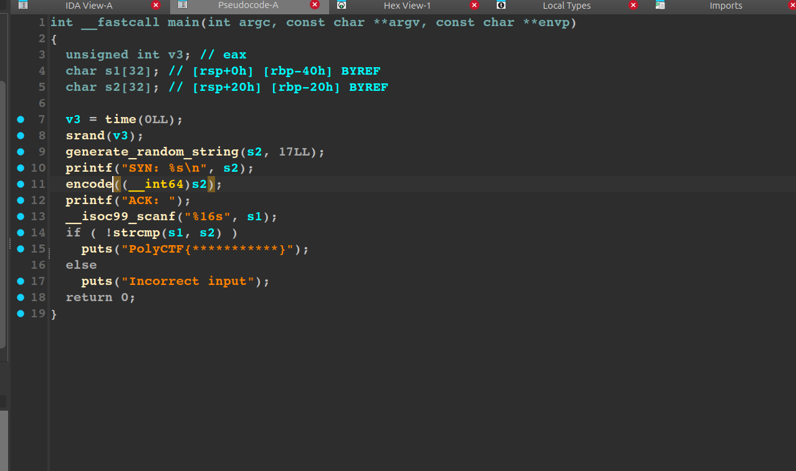
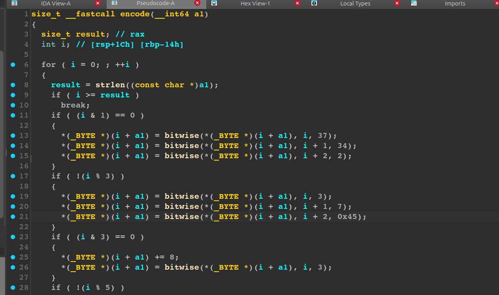
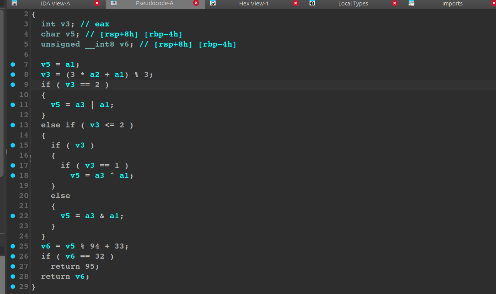

# TCP LIKE | easy | Reverse

## Информация
Помоги мне правильно ответить на запрос... (P.S. Для решения также понадобиться работать с: nc tasks.polyctf.ru 30009)

## Выдать участникам
[folder](public/)

## Описание
Необходимо разреверсить бинарь и понять способ модификации строки.

## Решение.
Первым делом открываем иду. Видим, создается некоторая рандомная строчка и затем каким-то образом преобразуется. А наша задача отправить обратно уже модифицированную строку.

Прыгаем в функцию encode. Существует цикл, который преобразует каждый символ определенным образом.

Прыгаем в функцию bitwise. А вот тут уже на основе индекса выбирается нужная побитовая операция, и в конце контроль выхода за печатаемые символы.

Теперь обладая всей возможной информации для получения флага можно аккуратно написать скрипт, реализующий данные преобразования. [decrypt](solve/decrypt.py)

## Флаг
`PolyCTF{1_L1k3_TCP}`
