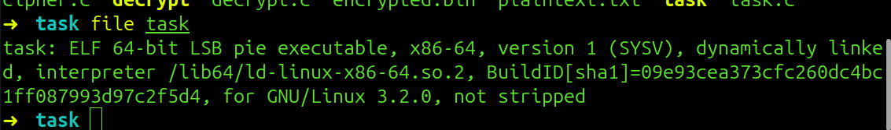
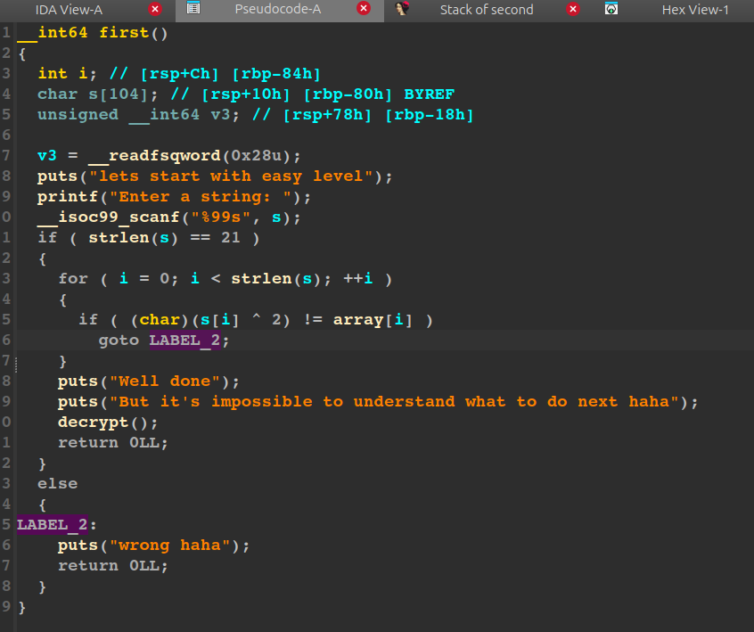
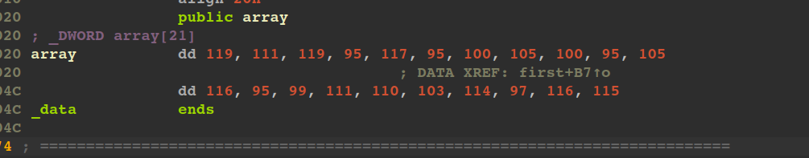
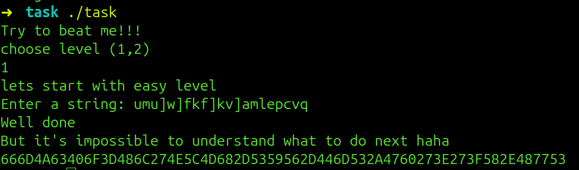
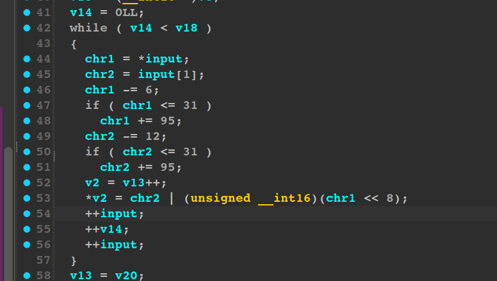
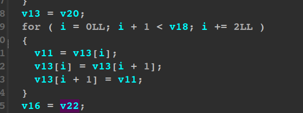

# Босс | easy | Reverse

## Информация
Сможешь одолеть трехэтапного босса?

## Выдать участникам
[folder](public/)

## Описание
Необходимо решить простейшую крякми, перевести из шестнадцатеричной системы в текст, написать декрипт шифра

## Решение.
Первым делом узнаем, что имеем дело с обычным elf x86-64 файлом.

 

Открываем иду, прыгаем в первую функцию. Видим проверку на длину строки и xor двойкой посимвольно с массивом array.

 

 

После ввода правильной строчки получаем комбинацию символов из шестнадцатеричного алфавита.
 
 

Затем нужно просто перевести в текст любым доступными способами и получить зашифрованную строчку **_fmJc@o=Hl'N\Mh-SYV-DmS*G`'>'?X.HwS**_. Переходим к третьему этапу и прыгаем во вторую функцую. Ида показывает не мало мусора, но стоит обратить внимание на первый адекватный цикл. 

 

Цикл на итерации берет по два символа, применяет сдвиг по аски на -6 и на -12, а затем преобразовывает эти 2 символа в единое число типа short. В следующем цикле можно увидеть простую парную перестановку 

 

Ну и далее по логике просто восстанавливается обратно вид строки. Я переписал весь код с иды, но фактически достаточно было просто реализовать небольшой сдвиг цезаря и попарную перестановку символов. [decrypt](solve/decrypt.c)
## Флаг
`PolyCTF{Thr33_St3P_b0Ss_D3f34TEd}`
