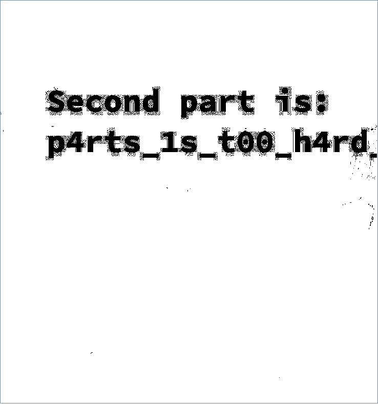

# Три кота ж | medium | steganography

## Информация
> Хотел найти трикотаж. Нашел это. Посмеялся.

## Выдать участникам
файл [three_cat_g.zip](public/three_cat_g.zip)

## Описание
Необходимо найти 3 части флага, спрятанных внутри изображения

## Решение
Дается изображение. При первичном его осмотре можно ничего не заметить, но если посмотреть цветовые слои, то на первом зеленом уровне увидим следующее:

Из этого делаем вывод, что флаг разделен на несколько частей. Исследуем изображение дальше. При просмотре метаданных, находим первую часть. 

Последняя часть спрятана с помощью алгоритма lsb. Заметить это можно по нулевым слоям изображения, которые выглядят так:

## Флаг
`PolyCTF{thr33_p4rts_1s_t00_h4rd_bUt_n0t_f0R_y0u}`
