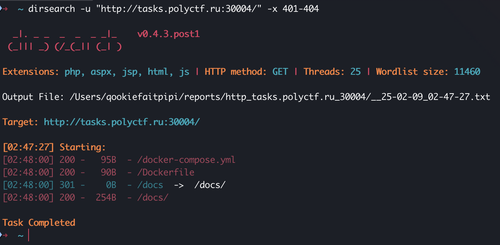
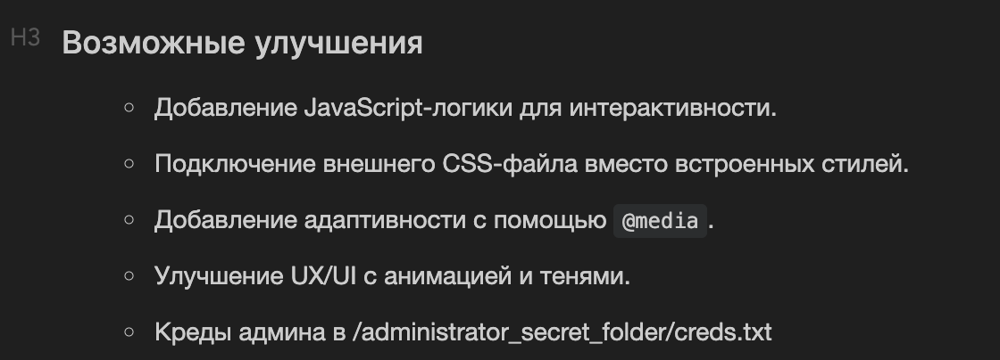

# Подробная документация | easy | web

## Информация
> Хорошая документация – залог понятного и безопасного кода

## Выдать участникам
Ссылка [link](http://tasks.polyctf.ru:30004/)

## Описание
В данном задании необходимо фаззить директории на ресурсе, тем самым, найти к нему документацию

## Решение
Для решения этого задания можно воспользоваться утилитой dirsearch:

Из вывода dirseach можно увидеть скрытую директорию /docs, в которой лежит файл documentation.md. Его необходимо скачать и внимательно прочитать 

В данной записи можно увидеть еще один скрытый путь, который было бы сложно перебрать с помощью фаззера. Переходим по /administrator_secret_folder/creds.txt и получаем флаг

## Флаг
`PolyCTF{adm!N_S3CRET_CRed$}`
