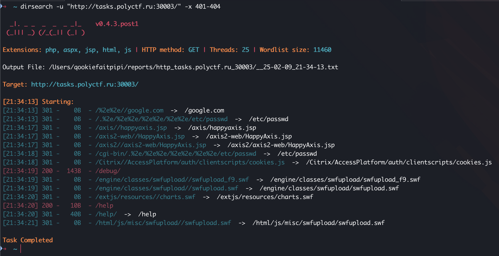
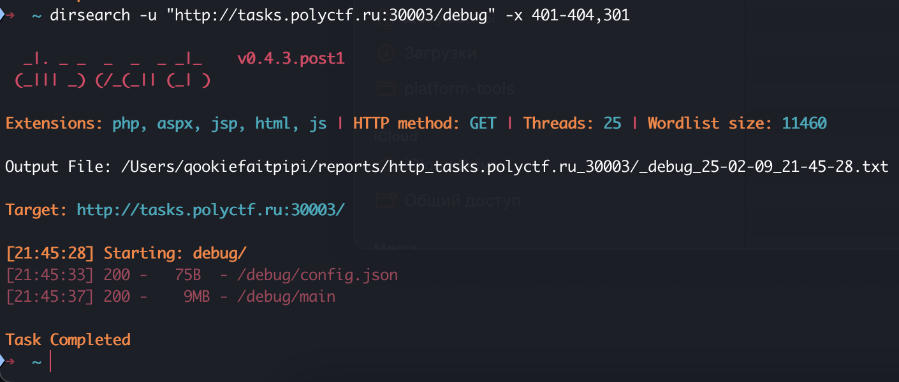
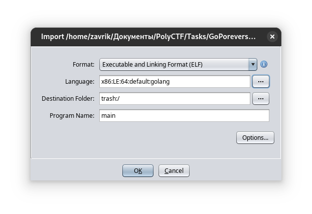
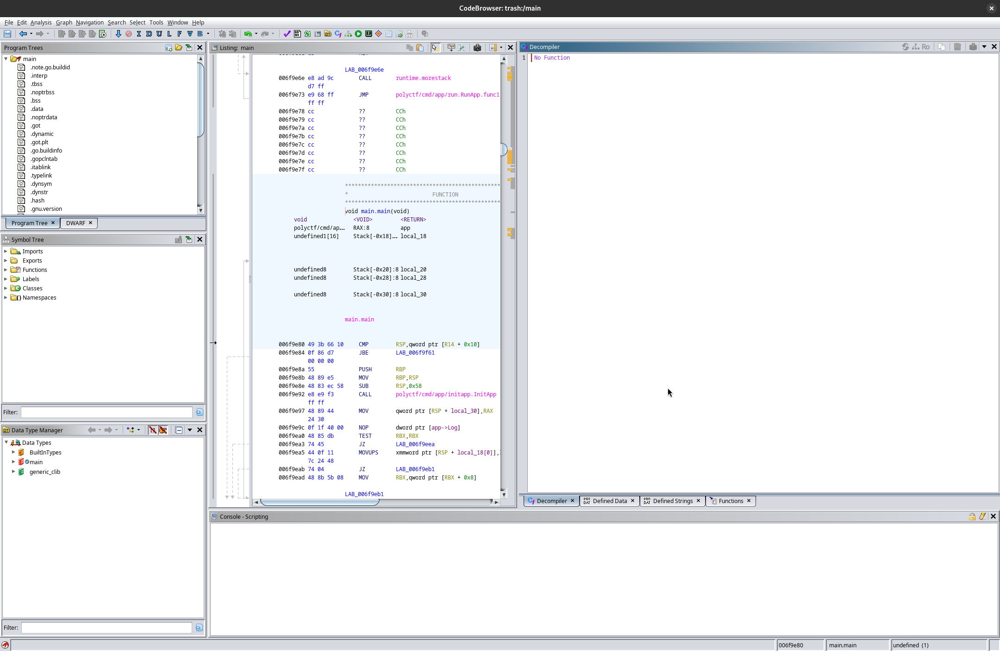
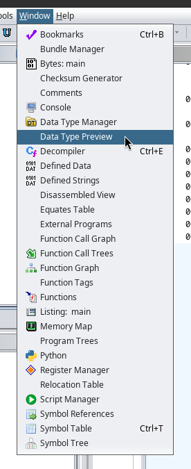
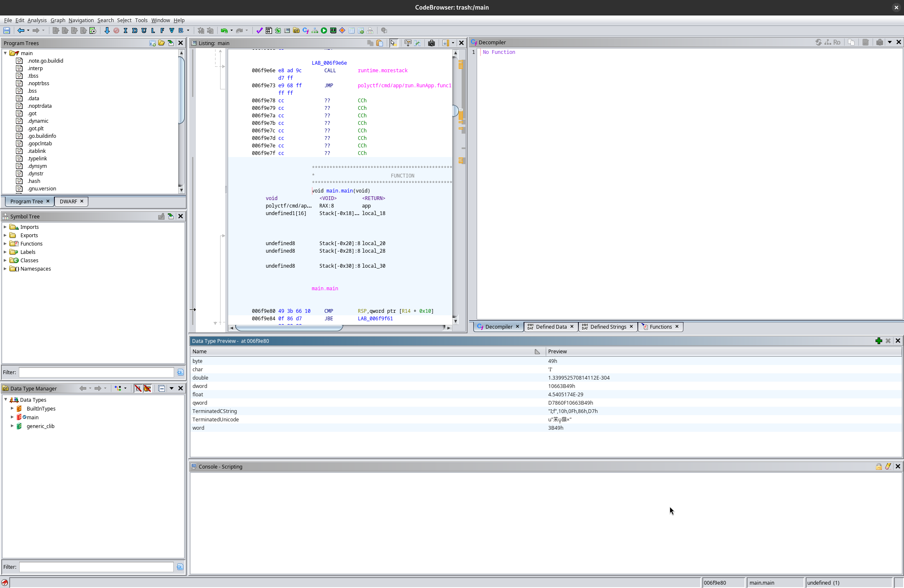
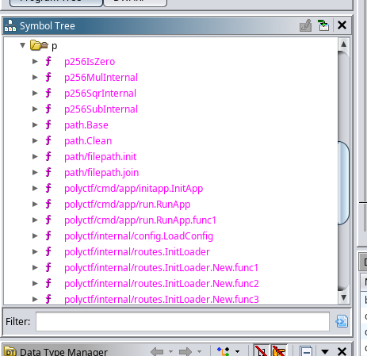
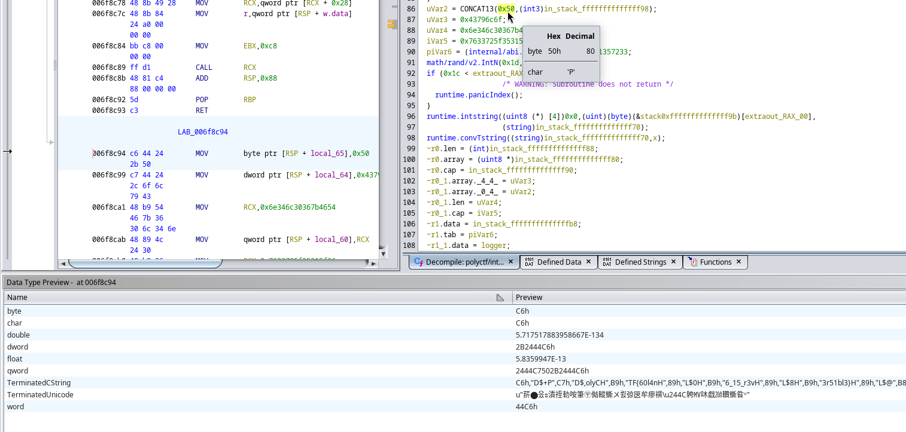

# Go-поревресим | medium | web

## Информация
> Я думал, что Go — это для быстрых решений, но оказалось что go-вно

## Выдать участникам
Ссылка [link](http://tasks.polyctf.ru:30002)

## Описание
В данном задании необходимо определить, что backend работает в debug-моде и реверснуть go backend.

## Решение
На этот раз фаззить директории на стороне фронта не имеет смысла. Необходимо фаззить бэк, например, с помощью утилиты [dirsearch](https://github.com/maurosoria/dirsearch)

Из вывода dirseach можно увидеть скрытую директорию /debug, в которой надо снова фаззить. 

Теперь мы можем увидеть, что мы можем скачать main – бинарь, написанный на go. Далее открываем бинарь в ghidra, обязательно изменив поле Language на golang:

Выполняем стандартную операцию открытия в CodeBrowser и запускаем Анализ файла (программа предложит при первом открытии). Получится что-то подобное:

Нам надо будет добавить ещё одно окно параметров кода:

Далее, слева в окошке, находим папку Functions и в ней функции, которые начинаются с polyctf:

Методом Научного тыка находим функцию `polyctf/internal/routes.InitLoader.New.func3`. В ней замечаем функцию `CONCAT13`, причём первым символом стоит `0x50` == `P`. Также, не зря же мы открывали окно `Data Type Preview`, мы видим, что если поставить курсор на эту строку, то внизу виднеется в поле `TerminatedString` что-то похожее на флаг:

В конце надо просто очистить от не нужных символов данную строчку, задача упрощается, так как флаг имеет осмысленное содержание.

## Флаг
`PolyCTF{60l4n6_15_r3v3r51bl3}`
