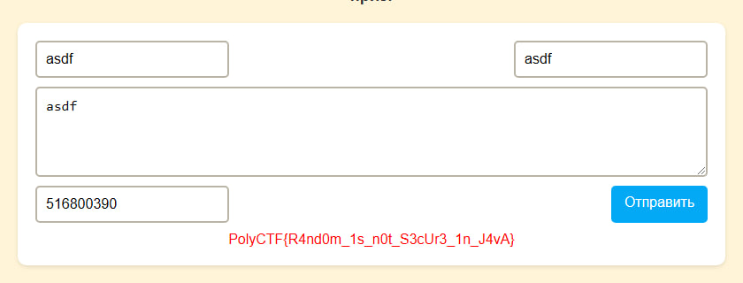

# Конкурс заметок | medium | web

## Информация

> Прими участие в конкурсе! 🎉 Опубликуй свою заметку и попробуй угадать её номер. Если ты назовёшь правильное число до публикации, победа будет за тобой! Проверь свою интуицию и удачу! 🔢✨

## Выдать участникам
[ссылка](http://tasks.polyctf.ru:30008/)

## Описание
Lfi в /api/notes/download?id= и /api/notes/list?dir=/ через double url encode -> сурсы приложения -> реализация уязвимости рандома на Java

## Решение
Изучив сетевые запросы при загрузке страницы и создании заметок найдем следющие эндпоинты: `/api/notes?id=` `/api/notes/list?dir=/`,  в заголовке созданных заметок есть ссылка на их скачивание по `/api/notes/download?id=`, эти эндпоинты потенциально уязвимы к LFI. 

Попробовав перейти по `/api/notes/list?dir=/..` получим ошибку 
>Disallowed characters in note ID

Заэнкодив `.` как `%252e` (double url encode) (. -> %2e, % -> %25) получим список файлов в папке на уровень выше заметок.

Просерчив файлы найдем /app/app.jar который можно скачать по `/api/notes/download?id=%252e%252e/%252e%252e/app/app%252ejar`

Разархивировав [app.jar](/solve/app.jar) и декомпилировав джава классы найдем как генерируются заметки

```java
private final Random random = new Random();
...
public ResponseEntity<String> createNote(@RequestBody Map<String, String> noteRequest) throws IOException {
	...
	String id = noteRequest.get("id");
	...
	String filename = String.valueOf(random.nextInt());
	...
	if (id != null && id.equals(filename)) {  
	    String flag = System.getenv("FLAG");  
	    responseJson.put("flag", flag != null ? flag : ""); 
	} 
}
```

Погуглив про уязвимости рандома в Джаве можно найти много статей в которых реализуется эксплоит [тык.](https://habr.com/ru/articles/151187/) [тык.](https://xakep.ru/2015/07/20/java-random-hack/)

Для получения флага нужно взять два id заметок идущих друг за другом, и с их помощью получить seed для Random. Зная seed можно узнать все последующие номера записок.

Пример реализации эксплоита есть в `./solve` [(взят из чата в канале PolyCTF)](https://t.me/c/1996175205/1914)



## Флаг
`PolyCTF{R4nd0m_1s_n0t_S3cUr3_1n_J4vA}`
